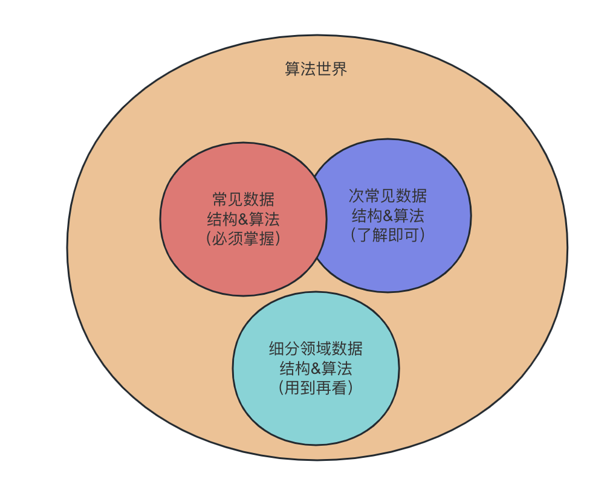

# 始于学习开始之前

## 学习目标

- 完全掌握常见的所有数据结构与算法（重要）
> 达到的效果: 
    - 输入: 任意场景问题
    - 输出: 给出该场景下合适的数据结构对问题进行建模 & 给出合适的算法对模型进行操作，并高效的解决实际问题
 
- 了解次常见的所有数据结构与算法
    - 对场景算法的一些特殊场景的补充
        - 针对二叉树遍历的另外一种方法：莫里斯(Morris)遍历法
    - 基于基础数据结构的一些变种结构
        - 从Btree演变过来的B+Tree
        - 从mergeTree演变过来的LSM Tree
- 以上两种都给不出解决方案时，寻找针对当前细分领域的数据结构&算法
    - 解决空间碰撞计算场景的数据结构&算法：rtree&碰撞计算

## 工具箱理论 

> 你作为一名专业的软件工程师，你必须拥有专业的工具箱，并熟练的使用它们（常见的数据结构和算法）。

### 打开工具箱 

从较粗粒度上来枚举它们：

- 数组
- 链表
- 二/多叉树
- 图
- 矩阵
- 堆
- 栈
- 队列
- 哈希表

### 不要成为“手里拿着锤子，看啥都是钉子”的人 

> KISS原则(Keep it Simple, Stupid) 

> KISS原则强调在软件开发中简洁性的重要性。它建议我们应该努力将代码和解决方案保持尽可能简单。
简化代码使其更易于理解、维护和调试，减少错误或问题的可能性。 

避免出现新学了一个高级数据结构（更高级往往意味着更多的复杂性），进而不管看见什么问题都往上套的情况。

## 从物理视角来细分工具箱 

> 工具箱里枚举的粒度很粗，我们来细分一下，以物理视角来观察

- 线性（连续）存储数据
    - 数组
        - 队列
            - 单调队列
            - 循环队列
        - 栈
            - 单调栈
        - 矩阵
- 随机（非连续）存储数据
    - 链表
        - 单/双向链表
        - 树
            - 二叉树
                - 二叉搜索树
            - N叉树 
                - B/B+树
                - LSM树
            - AVL树
                - 二叉平衡树
                - 红黑树
            - 前缀/后缀树
            - 最小/大生成树
            - 图
            - 堆
        - 哈希表

## 最佳实践 

### 看懂不等于学会

实践出真理，当你看懂的时候，最多=学会的1/3的程度，绝知此事要躬行。 
学习算法没有捷径，只有不断的实践，在实践中寻找到自己的解题思路，最终目标是应用到**解决工作、生活中具体的问题**中去。

### leetcode刷题

1w小时定律在算法学习时同样生效，量变引起质变，不如换一个量化指标(先刷够1k道题目):

- 简单题: 200+
- 中等题: 600+
- 困难题: 200+

### 尝试参加oj比赛

leetcode的周赛，适合新手

### 书籍推荐

> 进阶来看，小白劝退

- 算法珠玑
- 编程之美